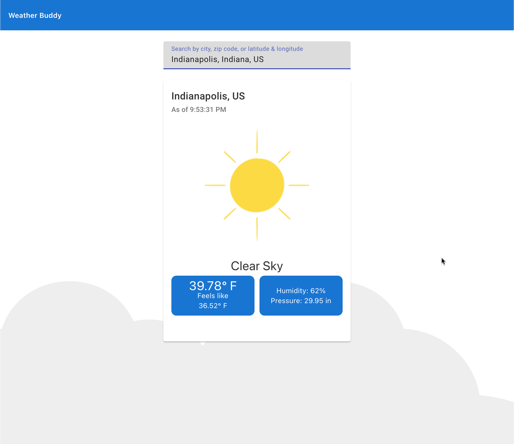
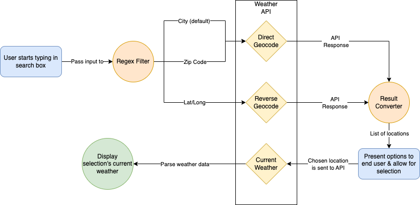

# Weather Buddy

Weather Buddy is a reference application for using the [OpenWeatherMap API](https://openweathermap.org/api) to display the current weather for a given location. A working version can be found at [https://weatherbuddy.azurewebsites.net](https://weatherbuddy.azurewebsites.net).

## Architecture

Weather buddy has a simple architecture. It's an Angular application that communicates with a proxy .NET Web API to communicate with the OpenWeatherMap API.

You can see a detailed flow of how the app handles searches for the user.

## Running locally

You'll need to do some first-time setup if you've never run the project locally:

1. Open up a terminal and navigate to the WeatherBuddy.Api folder
2. Run `dotnet user-secrets init`
3. Run `dotnet user-secrets set "OpenWeatherMap:ApiKey" "INSERT-YOUR-API-KEY-HERE"`, where you will need to provide your own OpenWeatherMap API key.

That's it for initial setup. The following is for regular development:

1. Open up a terminal and navigate to WeatherBuddy.Api and run `dotnet run` for a .NET dev server. The web API will be listening on [http://localhost:4100/](http://localhost:4100/) and [https://localhost:4101/](http://localhost:4101/).
2. Open another terminal and navigate to WeatherBuddy.Spa and run `ng serve` for a dev server. Navigate to [http://localhost:4200/](http://localhost:4200/). The application will automatically reload if you change any of the source files.

There are additional instructions on how to run [Docker containers](#docker).

## Angular Frontend

### Code scaffolding

Inside the WeatherBuddy.Spa folder, you can run `ng generate component component-name` to generate a new component. You can also use `ng generate directive|pipe|service|class|guard|interface|enum|module`.

### Build

Inside the WeatherBuddy.Spa folder, you can run `ng build` to build the project. The build artifacts will be stored in the `dist/` directory.

### Running unit tests

Inside the WeatherBuddy.Spa folder, you can run `ng test` to execute the unit tests via [Karma](https://karma-runner.github.io).

### Running end-to-end tests

Inside the WeatherBuddy.Spa folder, you can run `ng e2e` to execute the end-to-end tests via a platform of your choice. To use this command, you need to first add a package that implements end-to-end testing capabilities.

## Dotnet API backend

### Build

Inside the WeatherBuddy.Spa folder, you can run `ng build` to build the project. The build artifacts will be stored in the `dist/` directory.

## Docker

Dockerfiles for the angular app and the .NET API are included. These will build production ready versions of the angular app and .NET Web API.

## Future enhancements

- Mapping of api responses to models
  - Currently using models that match the responses to calls from OpenWeatherMap API. It would be more appropriate to craft models specific to the views and map data from API responses to these view models.
- Setup backend API to handle calls to OpenWeatherMap so that the API key can remain on the server side without being exposed on the client.
- CI/CD yaml
- Allow for selecting language (English, Spanish, French, etc)
- Allow for selecting units of measurement (Imperial vs Metric)
- Browser Geolocation popup
- Routing updated to include location information to allow for bookmarking / link sharing
- Error handling improved
