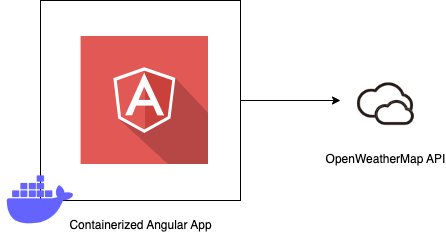

# Weather Buddy

Weather Buddy is a reference application for using the [OpenWeatherMap API](https://openweathermap.org/api) to display the current weather for a given location.

## Development server

First you'll need to create an environment file called `environment.development.ts` under `src/environments` if you don't already have one. You can copy the `environment.ts` file. You will need to provide an API key for OpenWeatherMap in the development environment file.

Run `ng serve` for a dev server. Navigate to [http://localhost:4200/](http://localhost:4200/). The application will automatically reload if you change any of the source files.

## Code scaffolding

Run `ng generate component component-name` to generate a new component. You can also use `ng generate directive|pipe|service|class|guard|interface|enum|module`.

## Build

Run `ng build` to build the project. The build artifacts will be stored in the `dist/` directory.

## Architecture

Weather buddy has a simple architecture. It's an Angular application whose primary means of hosting is via a docker container. The app currently only communicates with the OpenWeatherMap API.

You can see a detailed flow of how the app handles searches for the user.

## Docker

A Dockerfile is included along with a docker-compose file. This will build a production ready version of the angular app. You first need to ensure that there is an `environment.production.ts` file under `src/environments` and provide an API key for OpenWeatherMap. After that, all you need to do is run
`docker-compose up`. If you make any changes to the code you'll need to then run `docker-compose up --build` to update the Docker image. By default the container is listening on port 5500 and the app can be viewed at [http://localhost:5500](http://localhost:5500).

## Running unit tests

Run `ng test` to execute the unit tests via [Karma](https://karma-runner.github.io).

## Running end-to-end tests

Run `ng e2e` to execute the end-to-end tests via a platform of your choice. To use this command, you need to first add a package that implements end-to-end testing capabilities.

## Future enhancements

- Mapping of api responses to models
  - Currently using models that match the responses to calls from OpenWeatherMap API. It would be more appropriate to craft models specific to the views and map data from API responses to these view models.
- Setup backend API to handle calls to OpenWeatherMap so that the API key can remain on the server side without being exposed on the client.
- CI/CD yaml
- Allow for selecting language (English, Spanish, French, etc)
- Allow for selecting units of measurement (Imperial vs Metric)
- Browser Geolocation popup
- Routing updated to include location information to allow for bookmarking / link sharing
- Error handling improved
